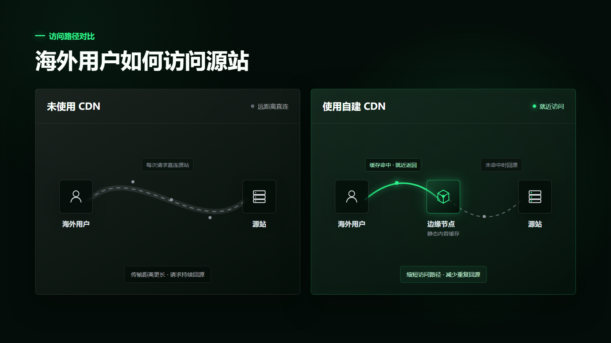
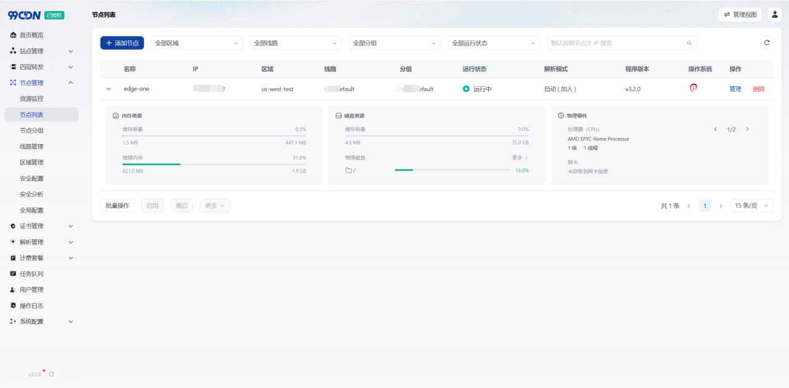

# 网站出海后访问变慢？自建 CDN 全球加速方案

网站出海会面临一个普遍问题：海外访问页面加载速度缓慢。有时可能出现打不开的情况，可能会极大影响用户访问体验以及后续的业务转化。那为什么海外网站访问速度慢，又该如何优化？下面从常见原因讲起，再介绍几种实际可用的加速方法。

## 海外访问速度为何重要
访问速度会直接影响网页内容的加载，也会影响搜索引擎抓取和用户正常浏览。网站可以打开，不代表不同地区都能顺畅访问。海外网站访问速度慢，常见原因主要有下面几点。

1. **源站距离较远：** 网页中的 HTML、图片、CSS 和脚本都要分别请求。用户离源站越远，每次请求花费的时间越长，累积起来就会拖慢整个页面。

2. **静态文件反复回源：** 图片和脚本没有缓存在节点上，每次访问都要回到源站获取，传输时间和源站带宽占用都会增加。

3. **访问入口比较单一：** 不同地区的请求都发往同一个源站，无法根据用户所在地区分配节点。服务器出现异常时，也缺少其他节点及时接替。

## 海外网站如何提速

针对这些问题，海外网站提速可以从下面几个方面入手。

1. **部署海外节点：** 在主要用户所在地区部署CDN节点，让图片、脚本和下载文件从距离更近的服务器返回。

2. **缓存静态内容：** 将重复访问的文件保存在节点上，内容没有更新时直接由节点返回，减少请求反复回到源站。

3. **合理分配请求：** 按照地区、线路和服务器配置安排节点，让不同节点承担合适的访问量。

4. **处理节点异常：** 持续检查节点状态，遇到网络或服务故障时，将请求切换到其他可用节点。
大多数CDN优化都是遵循这几步，但真正做起来，麻烦通常出现在节点增加以后。缓存规则需要保持一致，站点配置要同步，请求还要根据地区和节点状态进行分配。如果每台服务器都单独设置，后续维护也是一个庞大的工程。

## 自建 CDN 的优势

自建CDN可以继续使用已有的服务器和带宽资源，节点放在哪些地区，也可以根据网站的海外访问分布安排。静态内容较多的网站可以重点调整缓存，源站回源压力增加后，还能继续加入上游节点，不必让所有请求直接回到源站。

设置缓存和回源： 图片、CSS、JS和下载文件可以根据更新频率设置，内容更新后再刷新缓存。节点数量较多或回源压力增加时，可以继续配置多级回源和分片缓存。
节点和规则逐渐增多后，就需要一套主控系统统一管理。[99CDN](https://www.99cdn.com/?affid=zeroone)可以把站点、节点、缓存、证书和相关配置放到同一个后台。网站添加一次，后续接入的节点可以沿用相应配置，不用再分别维护多套站点设置。

除了常用的缓存与节点调度，99CDN 还支持多级节点回源和分片缓存。多级回源可以让边缘节点先向上游节点获取内容，上游没有时再访问源站；分片缓存则按照 URL 一致性哈希确定资源归属节点，减少组内重复缓存和重复回源。节点增加以后，这两项功能可以进一步减轻源站和节点存储的压力。

## 用 99CDN 完成加速

使用 99CDN 搭建海外加速，可以围绕三个部分来完成。

1. **接入节点和网站：** 准备好服务器后，先在99CDN中创建节点并完成节点程序安装，再添加网站、填写源站，上传或申请证书并开启HTTPS。站点保存后，还需要将业务域名通过CNAME接入CDN。源站、HTTPS和缓存等配置会由平台下发到对应节点，后续不用重复设置。

2. **设置缓存和回源：** 图片、CSS、JS和下载文件可以根据更新频率设置[缓存规则](https://docs.99cdn.com/user/site/cache.html/?affid=zeroone)，内容更新后再刷新缓存。节点数量较多或回源压力增加时，可以继续配置多级回源和分片缓存。

3. **完成节点调度：** 先建立区域、线路和节点分组，再将线路关联到相应的边缘节点组。边缘组启用分片缓存后，可以根据节点容量设置分片权重。节点解析模式设为自动时，系统会根据宕机检测结果调整节点是否参与解析。网站覆盖地区继续增加后，如果当前授权版本支持，还可以部署自建DNS并配置智能调度，根据访问来源、策略优先级和节点状态返回不同的解析结果。

从日常管理角度，我更看重的是CDN节点状态能够与DNS调度联动。节点解析采用自动模式后，异常节点可以随检测结果退出解析；节点、解析和站点配置也能放在同一套管理端中维护。这样不用在几套后台之间反复修改，多地区网站后续扩容和故障处理都会省事不少。

## 总结

海外网站提速可以先从一组核心节点开始，把静态缓存、节点调度和异常切换配置好，再随着访问范围增加上游节点或 DNS 调度。99CDN 将这些设置集中在一套主控后台，新增地区时可以继续沿用已有的站点和节点配置。对于已经准备好海外服务器和带宽的网站，下一步就是把这些分散的资源连起来，真正搭成一套方便管理、可以继续扩展的自建 CDN。
